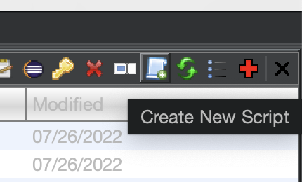

# GhidraGPT3

a Ghidra integration with GPT-3 that allows Ghidra to ask GPT-3 what an assembly function does

# installation
1. modify ./GhidraGPT3.py and fill config["api_key"]
2. open Ghidra, then Window->Script Manager
3. click 'Create New Script' then copy/paste ./GhidraGPT3.py, and save it

4. make sure 'GhidraGPT3' is enabled in the list ✔︎

# usage

[a video im using this extension](https://twitter.com/jumang4423/status/1608507662173626369)

1. click on the assembly function you would like me to analyze in Listing Window
2. control+option(alt)+g to launch GhidraGPT3
3. select prompt
4. wait the result
5. boom
